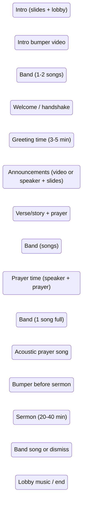
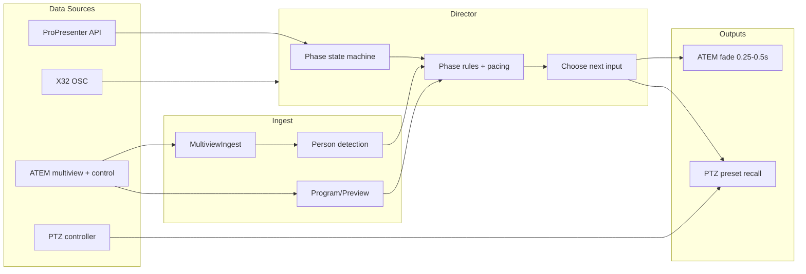

# Church Livestream Auto-Director — Concept and Plan

## Current state

- **Multiview pipeline** ([atem_director.py](c:\Users\JonBons\Documents\Repos\ND-AutoDirector\ATEM\atem_director.py), [multiview_ingest.py](c:\Users\JonBons\Documents\Repos\ND-AutoDirector\ATEM\multiview_ingest.py)): USB capture → layout (profile or auto) → per-input segments → YOLO person detection. Output: **which ATEM inputs have people**.
- **Gap**: No switcher control, no notion of service phase, no audio/ProPresenter/PTZ integration. The system only *analyzes*; it does not *direct*.

Goal: when the director and switcher step away, this system **drives the ATEM** (and optionally PTZ) so the livestream runs automatically and looks good.

---

## 1. Service flow (state machine)

Map your described flow into explicit **phases** so the director can apply phase-specific rules.

**ProPresenter playlist (example: "Sunday Service")**

Phase detection should align with your real playlist. A typical "Sunday Service" playlist might look like:

| Playlist item                 | Director phase            | Notes                                                                                                                    |
| ----------------------------- | ------------------------- | ------------------------------------------------------------------------------------------------------------------------ |
| Countdown - Pre Service Video | Intro                     | CG / countdown; hold on graphics.                                                                                        |
| Praise The Lord - Gateway     | Band (or BumperIn → Band) | First song; lyrics on output.                                                                                            |
| Welcome - Greeting            | Welcome / Greeting        | Welcome slides + announcement slides (e.g. Youth, RISE Ladies, Kidz, Wednesday meal, Baptism). Prefer CG/slides or wide. |
| Bible Time - Offering         | VersePrayer / Announce    | Bible + offering slides; may alternate CG with speaker.                                                                  |
| Rest On Us - Full Band        | Band                      | Lyrics; band coverage.                                                                                                   |
| Give Me Jesus - Upperroom     | Band / Acoustic           | Song; band or acoustic depending on arrangement.                                                                         |
| Prayer Time                   | PrayerTime                | Speaker + prayer; prefer speaker cam.                                                                                    |
| It's Well With My Soul        | Band / Acoustic           | Song.                                                                                                                    |
| Sermon                        | Sermon                    | Hero + PTZ + roamer, 15–45 s switching. ProPresenter may run a "Sermon" macro (e.g. lights).                             |
| Goodbye                       | Outro                     | End card / lobby; hold on CG until stream end.                                                                           |

Config should map **ProPresenter playlist item name** (or index) → **director phase**. Macros/actions in ProPresenter (e.g. "Sermon", "Send OBS to Screen", "Switch stage display to lyrics") can be used as additional triggers or for side effects (e.g. when "Sermon" runs, director recalls PTZ preset and applies sermon cut logic).

**Confidence monitor (stage display) layout:** You switch the back-of-room confidence monitor layout by phase—**NEW DAY LYRICS** during songs and **NEW DAY LIVE VIDEO** for everything else (welcome, announcements, sermon, etc.). If the ProPresenter API exposes the *current stage display layout*, the director can use it as an extra phase signal: "NEW DAY LYRICS" → song phase (Band/Acoustic); "NEW DAY LIVE VIDEO" → non-song (Welcome, Announce, Sermon, Prayer, etc.). That helps confirm or disambiguate phase when playlist item alone is unclear.

**What we need to account for:**

- **Phase detection**: How does the system know which phase it is?
  - **ProPresenter** (primary): **Current playlist and current item** from the ProPresenter API (e.g. "Sunday Service" → "Welcome - Greeting"). Map playlist item name (or index) to director phase via config. If available, **current stage display layout** (e.g. "NEW DAY LYRICS" vs "NEW DAY LIVE VIDEO") gives a simple song vs non-song hint. Optionally subscribe to macro/action events if the API exposes them (e.g. "Sermon" action fired → force Sermon phase).
  - **Time / run order**: Optional run sheet as fallback if ProPresenter is unavailable.
  - **Manual override**: Button or API to advance phase or force a phase (e.g. "we're in Sermon now").
- **Transitions**: Phases follow the playlist order as the operator advances items. Design for **ProPresenter playlist-driven** phase with optional time-based or manual override.

---

## 2. Data sources and roles

| Source               | What to ingest                                                                                                                                                                                                 | How it helps the director                                                                                                                                                                                                                                                                                                                                                                                                                                                                          |
| -------------------- | -------------------------------------------------------------------------------------------------------------------------------------------------------------------------------------------------------------- | -------------------------------------------------------------------------------------------------------------------------------------------------------------------------------------------------------------------------------------------------------------------------------------------------------------------------------------------------------------------------------------------------------------------------------------------------------------------------------------------------- |
| **ATEM**             | Multiview (existing) + **program/preview** and **cut** control via PyATEMMax                                                                                                                                   | Know current program; cut to chosen input; avoid cutting to same input.                                                                                                                                                                                                                                                                                                                                                                                                                            |
| **Behringer X32**    | **DCA group mute state** (band DCA); **level from ProPresenter computer channel** (when PP is playing audio/video); per-channel mute/level (OSC: `/dca/1/on`, meters, etc.)                                    | Band DCA as above. **ProPresenter channel level**: when PP has level + playlist/slide indicate full-screen content (e.g. video, bumper), consider cutting to full-screen PP input. **Beware**: PP computer also plays **house music** during pre-service, greeting, and dismissal—level will be present then too; use **phase + slide type** so we don’t cut to PP full screen when it’s just music and a static slide.                                                                            |
| **ProPresenter**     | Current **playlist** and **playlist item**; **stage display layout** ("NEW DAY LYRICS" = song, "NEW DAY LIVE VIDEO" = non-song); **current slide type** (video vs image vs text); optional macro/action events | Map current item to phase; layout refines song vs non-song. **Full-screen PP**: use X32 ProPresenter channel level + layout + **slide type**—cut to full-screen PP when phase and slide indicate primary PP content (countdown, bumper, video). **Beware**: house music from PP during pre-service, greeting, dismissal; use phase + slide type so we don’t cut to PP full screen on level alone. Prefer **CG input** for slides; **full-screen video** when slide is video and level/phase agree. |
| **PTZ camera**       | Recall preset (e.g. "Stage wide", "Pastor", "Stage left")                                                                                                                                                      | Per-phase preset recall so the PTZ shot matches the phase (e.g. wide for band, pastor close-up for sermon).                                                                                                                                                                                                                                                                                                                                                                                        |
| **Roamer (DJI RS5)** | One ATEM input; **per-segment stability/motion** on the roamer crop (from multiview)                                                                                                                           | Operator often **moves or relocates** to get a better shot. Only consider roamer when the shot is **stable** (low motion for a short window). When motion is high, treat as "repositioning" and **don’t cut to it**. Good shot = stable; relocating = exclude from cut decision. When available and stable, high priority in band/welcome/sermon.                                                                                                                                                  |

**What to account for:**

- **Configuration**: One place (e.g. `config.json` or env) that maps **ATEM input index → role**; **X32 channel → input** (which fader = which camera/source); **X32 channel for ProPresenter computer** (level = PP playing audio/video; use with slide type + phase for full-screen PP, not during house-music-only phases); and **X32 DCA group** for band (e.g. DCA 1 = band). Phase comes from ProPresenter playlist; band DCA is a supporting signal. When the band DCA is muted, director treats as “band not playing” and prefers speaker/CG/sermon; when unmuted, use band-style coverage only if playlist already indicates song.
- **Graceful degradation**: If ProPresenter is down, fall back to time or manual phase only. If X32 is unreachable, ignore audio and use only CV + phase. If PTZ control fails, keep cutting between other inputs.
- **Roamer optional**: Config flag "roamer in use" and input id; when false, director never selects that input. **Roamer stability**: Run motion/stability analysis on the roamer segment (e.g. frame-to-frame diff or Laplacian variance); only consider roamer as a cut candidate when it has been **stable** (motion below threshold) for a short window (e.g. 0.5–1.5 s). When the roamer is moving or relocating, exclude it from the candidate set so we never cut to a shot that’s in transit.

---

## 3. What to account for (checklist)

- **Input role mapping**: CG, PTZ, Roamer, fixed cams, graphics, playback — each as an ATEM input index (and optional X32 channel, PTZ preset). **X32 DCA**: Map band DCA; mute state is a **supporting** signal (muted = not band; unmuted = may be band or pre-song—playlist is primary for phase). **Roamer stability**: Motion/stability analysis on roamer segment (e.g. frame-diff or Laplacian variance); only offer roamer as cut candidate when stable for a window (e.g. 0.5–1.5 s); when moving/relocating, exclude from candidates.
- **Phase definitions**: Name, expected "best" source types (e.g. sermon → hero + PTZ + roamer with 15–45 s pacing; band → wide or roamer; announcements → CG/slides).
- **Phase detection**: ProPresenter-driven and/or time/run-sheet and/or manual.
- **Transition**: All switches use a **0.25 or 0.5 s fade** (mix), not hard cut; configurable duration. **Cut pacing**: Minimum time on shot (e.g. 3–8 s) and optional max time before encouraging a transition (e.g. 15–20 s for variety). Prevents rapid flicker and long static holds.
- **Dwell / debounce**: Don’t re-cut every frame; require "best" input to be stable for a short window (e.g. 0.5–1 s) before cutting.
- **Safety**: No cut during **bumper/video** phases if the bumper is full-screen on a dedicated input (or cut once to bumper at phase start and hold). Optional: "lock to CG" during intro/announcements so auto never takes CG down.
- **Black/freeze detection** (optional): Reuse or add simple per-segment checks (e.g. mean level, variance) so the director never cuts to black or frozen frames.
- **Backup / safe fallback input**: Define a **last-resort input** (e.g. CG or slides) in config. If all preferred inputs are bad (black, freeze, or excluded) for **N seconds**, fade to this backup so the stream never stays on a dead feed. Optional: configurable timeout (e.g. 5–15 s) before fallback.
- **Reconnection**: ATEM, X32, and ProPresenter connections can drop (network blip, device restart). Implement **reconnect with backoff**; after reconnect, **re-sync state** (e.g. read current program from ATEM, re-fetch playlist from ProPresenter). Do not assume connections are permanent.
- **Latency**: Multiview capture → analysis → decision → ATEM transition has latency (e.g. a few hundred ms). Document it; make the **loop rate configurable** (e.g. 5–15 fps) so you can trade responsiveness vs CPU. For most phases this is acceptable.
- **Recovery from bad program**: If **current program** goes black, freezes, or drops (camera power cycle, cable, wireless roamer dropout), the director should **auto-cut away** to the next best input (or to backup). Run black/freeze detection on the **program feed** (not just candidates); on detection, trigger an immediate fade to a safe input (e.g. CG or next eligible camera).
- **PTZ preset per phase**: When phase changes, optionally send PTZ preset recall (e.g. sermon → preset for right/center stage coverage; sermon uses hero + PTZ + roamer with active switching) so the PTZ shot is correct before it’s cut to.
- **Full-screen ProPresenter (house music caveat)**: Use **X32 ProPresenter channel level** + **ProPresenter current slide type** + **confidence monitor layout** + **phase** to decide when to cut to full-screen PP. Require phase and slide type (e.g. video) so we don’t cut to PP full screen when it’s only house music (pre-service, greeting, dismissal). Config: map X32 channel for ProPresenter computer.
- **Logging and observability**: Log phase changes, cut decisions (and why: e.g. "input 3 has person + unmuted"), and errors (X32/ProPresenter/ATEM disconnect) for later tuning and debugging.

---

## 4. How to make it look good (director logic per phase)

- **Intro (slides + lobby)**: Prefer **CG/slides** input. No cuts for variety; hold on graphics. **House music** may be playing from ProPresenter—don’t use X32 PP channel level alone to switch to full-screen PP; use playlist item (e.g. countdown video) and slide type so we only go full-screen when PP is showing primary content, not just music.
- **Bumper (intro or pre-sermon)**: Cut to **bumper/video** input once and hold for duration (phase end = next phase or time).
- **Band**: Prefer **wide** or **roamer** (only when **roamer is stable**—see cross-cutting rule); use **person detection** to avoid empty stage. If X32 shows lead vocal or instrument up, prefer that channel’s mapped camera if available. Apply **cut pacing** (min/max on shot) for variety.
- **Welcome / Greeting**: Prefer **wide** or **roamer** (only when **roamer is stable**); optional PTZ preset "audience/wide". Fewer cuts; hold 5–15 s. **House music** often plays from ProPresenter here—don’t switch to full-screen PP on level alone; use phase + slide type (e.g. video slide) before cutting to PP full screen.
- **Announcements**: Prefer **CG/slides** when ProPresenter is on announcement content; if speaker is on camera with slides, can alternate **speaker** vs **CG** with longer dwell (e.g. 10 s on speaker, 8 s on slides).
- **Verse / story + prayer**: Prefer **speaker** (pastor or host); PTZ preset "pastor" or "pulpit". Hold on speaker; no need for frequent cuts.
- **Prayer time (band + speaker)**: Prefer **speaker** when talking; when band plays, same as Band rules. Use X32 to favor the live channel (speaker vs band).
- **Acoustic song**: Prefer **tight** shot (PTZ or roamer when **roamer is stable**) on the 1–3 people; person detection to keep them in frame.
- **Sermon**: **Active switching every 15–45 seconds** among three sermon cameras. Cameras are positioned for full stage coverage:
  - **Hero**: One camera (wide or following pastor from center of room) — main establishing / center coverage.
  - **PTZ**: Back right corner of room — typically aimed to cover pastor moving **left→center** or **right of stage**. Recall sermon PTZ preset at phase start (e.g. "Pastor right/center").
  - **Roamer**: Stage left, aimed at **left and center** — catches pastor when he moves from **right toward center or left**.
  Director logic: apply **sermon-specific cut pacing** (e.g. min 15 s, max 45 s on shot). Rotate among hero, PTZ, and roamer; **only consider roamer when its shot is stable** (not moving/relocating); prefer input with **person detected** when multiple are eligible; avoid cutting back to the same input immediately (cycle through the three for variety). Config should tag these three inputs as "sermon" role so the director only chooses among them during this phase.
- **Band (post-sermon) / Dismiss**: Same as Band; then transition to **CG** or **lobby** for end card; hold until stream end.
- **Outro**: **CG/lobby** only; hold. **House music** may be playing from ProPresenter—same as intro: use playlist/slide type for full-screen PP, not level alone.

**Cross-cutting rules:**

- **Prefer input with person** (from existing YOLO) when multiple inputs are eligible.
- **Prefer input that is live in mix** (X32 unmuted + level) when choosing between two person-present inputs.
- **X32 band DCA (secondary to playlist)**: **ProPresenter playlist drives phase**; band DCA is an extra consideration. When **band DCA is muted**, prefer speaker/CG/sermon and don’t use band-style coverage (you’re not in a song). When **band DCA is unmuted**, it may be pre-song (1–3 min early), so don’t switch to band coverage on DCA alone—only use band-style coverage when the playlist already says song phase. Use DCA to refine, not to override playlist.
- **Respect "roamer in use"**: When enabled, weight roamer higher in band/welcome/sermon; when disabled, never cut to it. **Roamer stability**: Only cut to the roamer when its shot is **stable**—not in motion or relocating. Use per-segment motion analysis (e.g. on the roamer crop from multiview); when motion is high or the frame is changing rapidly, treat as "operator getting a better shot or relocating" and **exclude roamer** from the candidate list until it has been stable for a short window (e.g. 0.5–1.5 s). Be vigilant: good shot = stable; repositioning = do not cut to it.
- **Cut pacing**: After a cut, enforce minimum time before next cut; optionally suggest a cut after max time if another input is "good enough."
- **Full-screen ProPresenter**: Switch to full-screen PP input when **X32 ProPresenter channel has level** and **ProPresenter** shows primary content: confidence monitor layout + **current slide type** (e.g. video) and **playlist item** (countdown, bumper, video announcement) all indicate full-screen. **Never** use PP channel level alone—house music runs from PP during pre-service, greeting, and dismissal; require phase + slide type so we don’t cut to PP when it’s just music and a static slide.

---

## 5. High-level architecture

- **Config**: Input roles, phase list, phase–source preferences, PTZ preset per phase, X32 channel → input mapping, pacing (min/max on shot), **transition duration** (0.25 or 0.5 s fade), **backup/safe fallback input** (e.g. CG) and optional timeout (N seconds), **loop rate** (e.g. 5–15 fps, for latency vs CPU tradeoff), and time/run-sheet (optional).
- **State**: Current phase, program input, last cut time, **run mode** (running / paused / rehearsal / manual / stopped), (optional) run-sheet start time. Connection state for ATEM, X32, ProPresenter (for reconnection and re-sync).
- **Loop**: Every tick (e.g. 5–15 fps from multiview): (1) Update phase (ProPresenter / time / manual); **reconnect** to ATEM/X32/ProPresenter with backoff if disconnected; after reconnect, re-sync (program, playlist). (2) Optionally recall PTZ preset on phase change (skip in rehearsal). (3) Gather signals: inputs with person, X32 live channels, current program. (4) **Recovery**: If **current program** is bad (black/freeze/drop), immediately fade to next best or backup input. (5) Apply phase rules + pacing; if a different input is chosen and dwell passed: in **running** mode execute transition (0.25 or 0.5 s fade); in **rehearsal** mode only log "would have cut to input N because …"; in **paused** or **manual** do not transition. (6) **Backup**: If no good candidate for N seconds, fade to **backup/safe fallback** input.

---

## 6. Implementation summary (no code yet)

1. **Config model**: Define schema for input roles, phases, phase→source preferences, PTZ presets, X32 mapping, pacing, and optional run-sheet.
2. **ATEM control**: Add PyATEMMax (or equivalent) to connect, read program/preview, and perform transitions. Use **fade (mix)** at 0.25 or 0.5 s duration for all changes; no hard cuts. Keep MultiviewIngest + detector as-is for "inputs with people."
3. **Adapters**: Thin modules for X32 (OSC meters/mute), ProPresenter (current slide/presentation), and PTZ (preset recall). Each can be disabled if unavailable.
4. **Phase state machine**: States as above; transitions from ProPresenter and/or time and/or manual; emit "phase changed" for PTZ and for rule set switch.
5. **Director core**: Loop that (a) updates phase, (b) on phase change optionally recalls PTZ (except in rehearsal), (c) runs phase rules with CV + X32 + current program and pacing, (d) in **running** mode executes transition when decision is stable and dwell satisfied; in **rehearsal** mode only logs "would have cut to input N because …"; in paused/manual does not transition.
6. **Safety and fallbacks**: No cut during bumper (or cut once and hold); optional black/freeze check; fallbacks when a source is missing; logging for every cut and phase change. **Backup/safe fallback**: Configurable last-resort input (e.g. CG) and timeout; if no good candidate for N seconds, fade to backup. **Recovery from bad program**: Black/freeze detection on the **program** feed; on detection, immediately fade to next best or backup input. **Reconnection**: Reconnect to ATEM, X32, ProPresenter with backoff; after reconnect, re-sync state (current program, playlist). **Latency**: Make loop rate configurable (e.g. 5–15 fps); document pipeline latency (capture → decision → transition).
7. **Web interface**: Backend API + simple web UI for control (pause/resume, manual takeover, force phase/transition), config (edit and apply, validate), debugging (live state, signals, candidates, preview-only toggle), and log viewer. See Section 7.

---

## 7. Web interface for control, config, and debugging

A **web UI** gives operators and techs one place to run the auto director, change settings, and troubleshoot without editing config files or SSH.

**Control**

- **Run state**: Start / stop the director (or start with "paused" so it only runs after you press Resume). Show current state: **running**, **paused**, **rehearsal**, **manual takeover**, or **stopped**.
- **Pause / Resume**: Pause = director keeps reading phase and sources but does not send transitions; resume = resume automatic transitions. Useful when you need to hold on a shot briefly without going full manual.
- **Rehearsal mode**: A **first-class mode** (selectable like running/paused/manual). In rehearsal, the director runs the **full pipeline** (phase, rules, decision) but **does not send ATEM transitions**—only logs "would have cut to input N because …". Use it to tune thresholds, phase→playlist mapping, and roamer stability without affecting the live switcher. Toggle from the UI.
- **Manual takeover**: Toggle **auto vs manual**. In manual, the director stops sending transitions; ATEM stays on whatever the operator selects. Clear indicator so everyone knows who is driving (auto vs human).
- **Force phase** (optional): Override current phase (e.g. "we're in Sermon now") for testing or when ProPresenter isn't advancing.
- **Force transition** (optional): "Go to input N now" for testing or recovery, with the same 0.25–0.5 s fade.

**Configuration**

- **Edit config in the UI**: Forms or structured editor for input roles (ATEM input → role, e.g. CG, PTZ, roamer, sermon hero), phase list, **playlist item → phase** mapping, X32 channels (band DCA, ProPresenter computer), PTZ preset per phase, pacing (min/max on shot), transition duration (0.25 / 0.5 s), roamer stability window, etc. Save and apply; optionally **validate** before apply and show errors.
- **Reload / hot-reload**: Apply config without restarting the director process where possible (e.g. phase rules, mappings). Restart only when necessary (e.g. capture device or layout change).

**Debugging**

- **Multiview preview with stat overlays**: Show the **multiview** (or a grid of per-input segments) in the web UI. **Does not need to be realtime**—e.g. snapshot every 1–5 s or on-demand refresh is fine. On each input cell, **overlay the stats** for that input: e.g. person (yes/no + confidence), roamer stable? (for roamer input), X32 mute/level if mapped, "eligible" / "chosen" badge, and optionally a small label (role: CG, PTZ, roamer, sermon hero). Makes it easy to see at a glance why each shot looks the way it does and why the director chose or skipped it. Layout can match your ATEM multiview (profile) or a simple grid.
- **Live state**: Current **phase**, **program** input, **preview** input (if preview-before-take), **last transition** time and target. Refreshes in real time (e.g. WebSocket or short polling).
- **Signals**: Per-input and system signals: **person detection** (which inputs have person, confidence), **roamer stable?** (yes/no, last N seconds), **X32** (band DCA muted/unmuted, ProPresenter channel level), **ProPresenter** (current playlist, item, slide type, stage display layout). Explains "why we're on this shot" or "why we're not cutting."
- **Candidates**: List of inputs that are **eligible** this tick and the **chosen** one with short reason (e.g. "input 3: person, stable, unmuted; chosen for band phase").
- **Test mode**: Toggle **preview-only** from the UI (director sets preview only, never program). Lets you verify decisions without affecting the stream.

**Log**

- **Log viewer**: Stream or paginate **recent logs** (phase changes, transitions with from/to input and reason, errors, reconnections). Filter by level (info / warn / error) or search text. Optional: export or download for post-service review.
- **Connection status**: ATEM, X32, ProPresenter, PTZ (and optionally multiview capture) connection state and last successful read, so you can see "ProPresenter disconnected 2 min ago" at a glance.

**Implementation notes**

- **Backend**: Small API (e.g. FastAPI or Flask) that the director process hosts or talks to. Endpoints for control (pause, resume, manual, force phase, force transition), config (get / update / validate), and debug (state, signals, candidates). WebSocket or Server-Sent Events for **live state and log tail** so the UI updates without constant polling.
- **Frontend**: Simple single-page app or server-rendered pages. No need for a heavy framework; focus on clarity and working on a tablet or laptop in the control room.
- **Security**: If the UI is only on the same machine or local network, basic auth or a simple shared secret may be enough. If exposed (e.g. for remote monitoring), use HTTPS and proper auth so only authorized users can control or change config.

Including the web interface in the plan keeps control, config, and debugging in one place and makes the auto director operable without touching the command line or config files during a service.

---

This gives you a single concept and plan: what to account for (phases, sources, config, pacing, safety), and how to make it look good (phase-specific rules, person + audio preference, PTZ presets, and cut pacing). Implementation can then follow in the ATEM package and config files.
